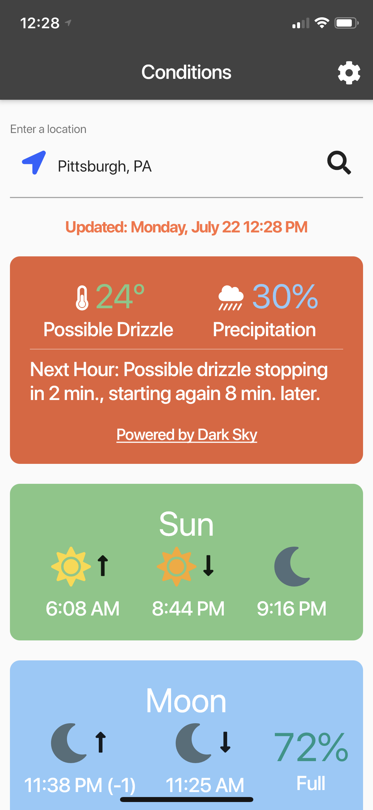

# conditions

This is a [Flutter](https://flutter.dev) project that shows the current conditions outside, both weather and astronomical. It shows the sunrise, sunset, dusk, moon rise, moon set, and how full the moon currently is, in addition to the current weather conditions.

I made this app to learn more about Flutter, and to make an app that gives a good overview of the current conditions outside for if you're about to leave to go somewhere or take a walk.

## Screenshots

##### This is the main page of the app

##### This page shows more details of the current conditions

